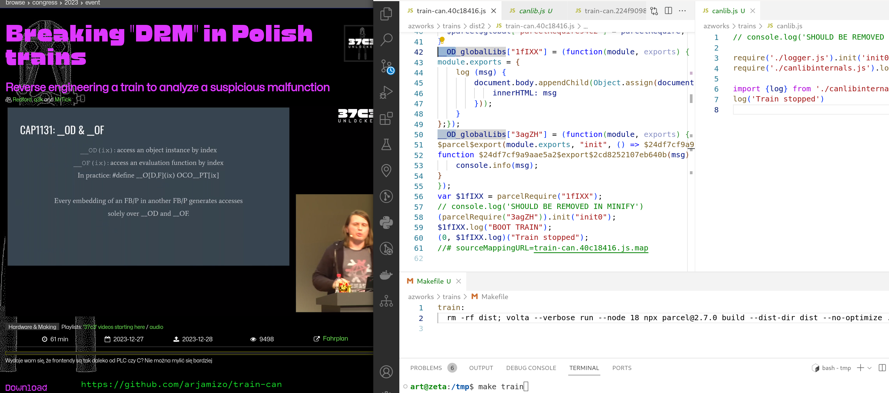

Train-CAN
=

train canbus impl. simulation in js

according<strike>lg</strike>ly to the saying that
 everything will be eventually written in any form of lisp (js in this case)

How to run
=

in order to run everything is provided in the repo; `make train` is generally fine assuming all commands avail on the screen are avail in your `PATH`

Screenshot
=

Credits
=

most probably and mostly `dragonsector`
this repo - az
